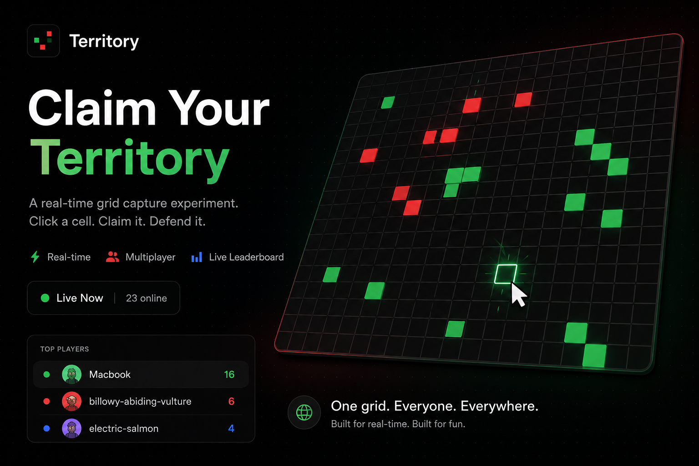

<div align="center">
  
</div>

# Territory: Real-Time Multiplayer Grid Game

**Territory** is a fast-paced, real-time multiplayer grid capture experiment. With a board of **1,008 tiles** (36×28), players compete to claim the most cells. Built with a robust modern stack using **Next.js** for the frontend and **Convex** for seamless real-time state synchronization.

## 🚀 Features

- **Real-Time Multiplayer**: Everyone shares the same board. Convex syncs every tile instantly using reactive queries and mutations.
- **Dynamic Board Wipes**: The grid automatically clears itself every 30 minutes to keep the game fresh.
- **Auto-Cleanup**: Inactive players are automatically removed from the board after 2 minutes of no heartbeat.
- **Clean Aesthetic**: A minimalist, high-contrast monochrome design with a sleek UI.
- **Responsive Layout**: The game grid scales dynamically to fit perfectly in your browser window.

## 🛠 Tech Stack

- **Framework**: [Next.js](https://nextjs.org/) (App Router)
- **Backend & Realtime DB**: [Convex](https://convex.dev/)
- **Styling**: [Tailwind CSS v4](https://tailwindcss.com/)
- **Language**: TypeScript

## 📂 Project Structure

```
├── app/               # Next.js App Router (Layout, Pages, Global CSS)
├── components/        # React Components (TerritoryPage UI)
├── convex/            # Backend (Schema, Queries, Mutations, Crons)
├── hooks/             # Custom React Hooks (useGridConvex)
├── public/            # Static Assets (Open Graph image, SVGs)
└── lib/               # Shared Utilities
```

## 🏁 Quick Start

### Prerequisites
- Node.js 18+
- pnpm

### 1. Start the Backend (Convex)
Open your terminal and run:
```bash
pnpm install
pnpm exec convex dev
```
*This command initializes your Convex project and sets up `NEXT_PUBLIC_CONVEX_URL` in `.env.local`. Leave this process running!*

### 2. Start the Frontend (Next.js)
Open a **new** terminal window and run:
```bash
pnpm dev
```
Visit **[http://localhost:3000](http://localhost:3000)** in your browser to start playing!

## 🧠 How It Works

1. **State Synchronization**: Convex `getSnapshot` queries subscribe to the board state. Every click triggers a `capture` mutation, instantly updating the board for all connected players.
2. **Session Management**: Each player gets a unique, randomly generated "kebab-case" name and distinct color. The `players` table tracks a `lastSeenAt` heartbeat.
3. **Crons**: Convex cron jobs handle game resets (wiping the board every 30 mins) and pruning stale players.

## 🚢 Deployment

1. **Backend**: Run `pnpm exec convex deploy` to push your Convex functions to production.
2. **Frontend**: Deploy your Next.js app to Vercel (or any other host) and ensure `NEXT_PUBLIC_CONVEX_URL` is configured in your production environment variables.
